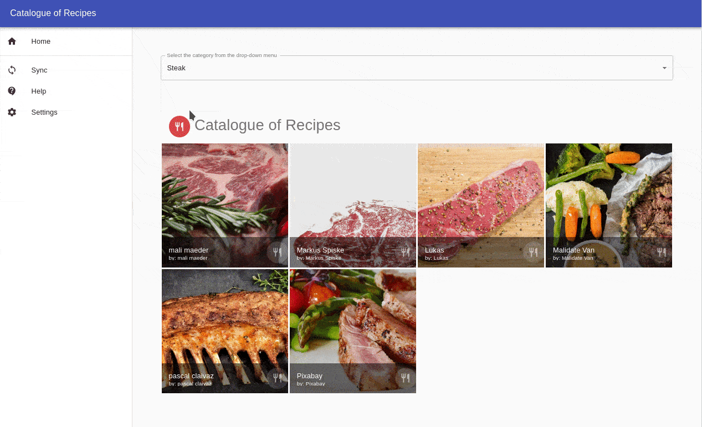

# Catalogue-of-Recipes

> This is a recipe catalog based project made using react and redux

Catalog-of-Recipes is a front-end application that will help you retrieve food images from [Pexels Image & Video API](https://www.pexels.com/api/), filter and access details of unique food.



## Built With

- Node.js
- React
- React-DOM
- React-Create-App
- Redux
- CSS
- ES6
- Material-ui

## Tested With

- Jest
- Enzyme
- redux-mock-store
- moxios

## Live Demo

[Live Demo Link](https://catalogue-recipes.herokuapp.com/)

## Getting Started

To get a local copy up and running follow these simple example steps.

### Prerequisites

- NPM
- JavaScript

### Setup

Navigate to your desired location to download the contents of this repository.
In order to clone this repository just type the following commands over the terminal in Linux or Mac or the Windows cmd console.

```s
git clone https://github.com/guillainbisimwa/Catalogue-of-Recipes.git

```

### Install

Run the following commands to install dependencies:

```s
cd Catalogue-of-Recipes
npm install

```

### API key Integration

Create a `.env` file in the root directory of this project. Add
environment-specific variables on new lines in the form of `NAME=VALUE`.
For example:

REACT_APP_SERVER_URL=...
REACT_APP_AUTH=...
REACT_APP_KEY=...
REACT_APP_HOST=...

You can find all your values from [Pexels Image & Video API](https://www.pexels.com/api/) and [rapidapi](https://rapidapi.com/pexels-pexels-default/api/Pexels). Just create an account a request for the API key.

The environment variables from a `.env` file are loaded into [`process.env`](https://nodejs.org/docs/latest/api/process.html#process_process_env) and used in actions file located in `Catalogue-of-Recipes/src/redux/actions/index.js`.

### Usage

In order to run this project locally, just type this command:

```s
npm start

```

### Test

In order to test this project locally, just type this command:

```s
npm test

```

## Author

👤 **Guillain Bisimwa**

- Github : [@guillainbisimwa](https://github.com/guillainbisimwa)
- Twitter : [@gullain_bisimwa](https://twitter.com/gullain_bisimwa)
- Linkedin : [guillain-bisimwa](https://www.linkedin.com/in/guillain-bisimwa-8a8b7a7b/)

## 🤝 Contributing

Contributions, issues, and feature requests are welcome!

Feel free to check the [issues page](https://github.com/guillainbisimwa/Catalogue-of-Recipes/issues).

## Acknowledgments

- [Pexels Image & Video API](https://www.pexels.com/api/)
- Design by Marc-Antoine Roy on [Behance](https://www.behance.net/gallery/11351281/NomNom)
- Microverse

## Show your support

Give a ⭐️ if you like this project!

## 📝 License

This project is [MIT](lic.url) licensed.
